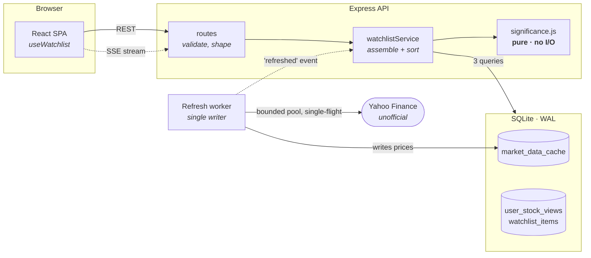
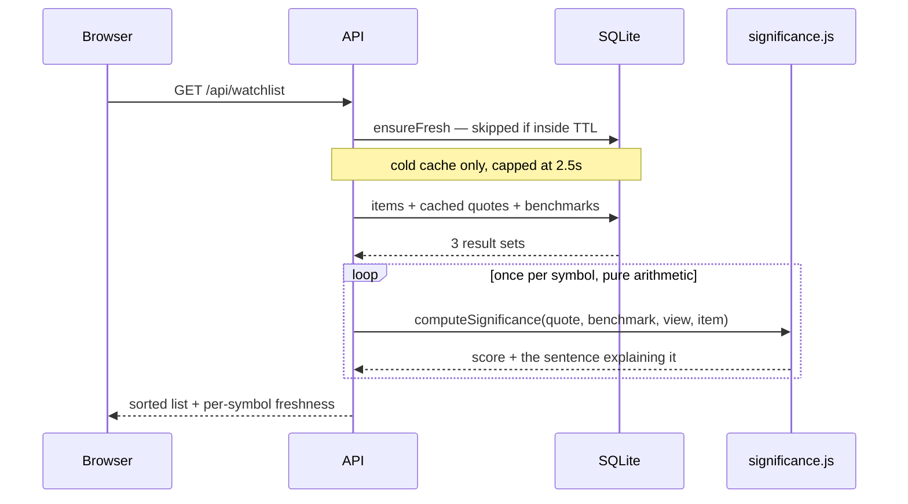
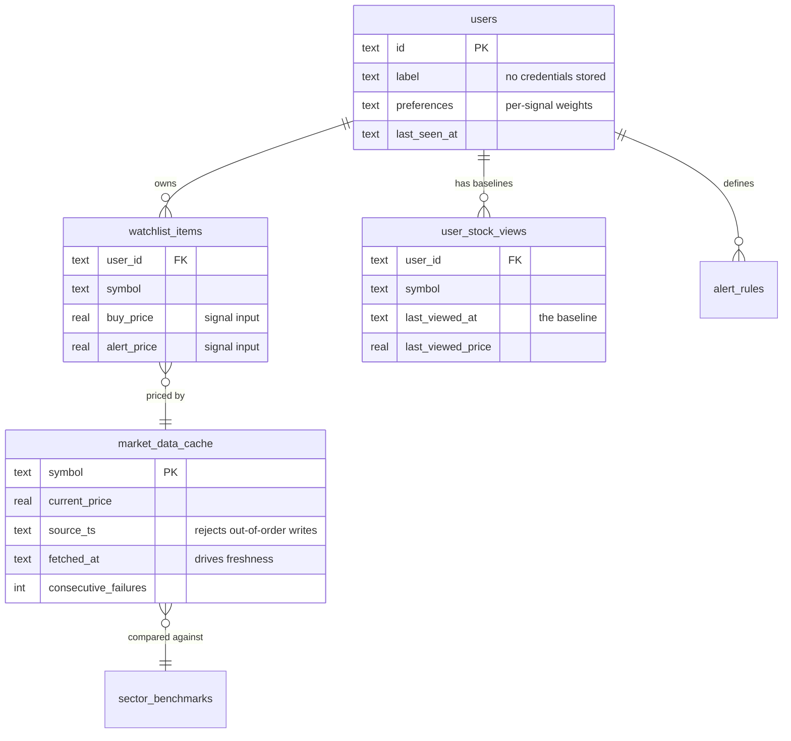

# Radar AI — an attention-aware watchlist

> Every watchlist shows prices. This one shows what *changed*, and ranks it.
>
> Radar AI scores each stock on unusual volume, range breakouts, sector
> divergence, 52-week proximity, drift since **you** last looked, and your own
> price levels — then sorts by what deserves attention. Come back after a day
> away and you don't see twenty unchanged prices. You see the three things that
> moved, and why.

Built for the **Code, by Groww** challenge. Node + Express + SQLite on the back,
React + Vite + Tailwind on the front, live NSE data.

---

## Where to look

Each evaluation criterion maps to the section that argues it. If you read one
thing, read [the noisy-OR decision](#the-decision-id-defend-hardest-noisy-or-not-a-weighted-average) — the rest of the
system is shaped around it.

| Criterion | Section | The claim |
|---|---|---|
| **Engineering depth** | [Architecture](#architecture) · [How it scales](#how-it-scales) | One background worker owns all fetching, so upstream load scales with *distinct symbols*, not users. The read path is 3 queries and a pure O(n) loop at any list size. |
| **Product & problem interpretation** | [The unit of the UI is a reason](#the-unit-of-the-ui-is-a-reason) · [What counts as a meaningful change](#what-counts-as-a-meaningful-change) | The real question is "what changed since *I* last looked" — a per-user baseline, not a day-change column. And visiting is not the same as acknowledging. |
| **Edge cases & resilience** | [Data integrity](#data-integrity-stale-delayed-and-conflicting) · [Edge cases](#edge-cases-handled) | The provider returned 429 on the first call I ever made to it. It is treated as hostile: monotonic writes, a reconciliation ladder for three conflicting "previous close" fields, and a rule that stale data is never rendered as live. |
| **Code quality & simplicity** | [What I chose *not* to build](#what-i-chose-not-to-build) · [Tests](#tests) | Six signals, no indicator zoo, no LLM, no microservices. The scoring engine is a pure function, which is what makes 68 tests cheap to write. |
| **Originality & thoughtfulness** | [Noisy-OR](#the-decision-id-defend-hardest-noisy-or-not-a-weighted-average) · [Two clocks](#two-clocks-for-one-idea-a-bug-that-survives-demos) | Averaging signals is the obvious combiner and it is wrong for attention: four calm signals bury the one that is firing. |

<details>
<summary><b>Full contents</b></summary>

- [Run it](#run-it)
- [The unit of the UI is a reason](#the-unit-of-the-ui-is-a-reason)
- [What counts as a meaningful change](#what-counts-as-a-meaningful-change)
- [The decision I'd defend hardest: noisy-OR, not a weighted average](#the-decision-id-defend-hardest-noisy-or-not-a-weighted-average)
- [Built on top of the engine](#built-on-top-of-the-engine)
- [Architecture](#architecture)
- [Identity and persistence](#identity-and-persistence)
- [Data integrity: stale, delayed and conflicting](#data-integrity-stale-delayed-and-conflicting)
- [Edge cases handled](#edge-cases-handled)
- [Two clocks for one idea](#two-clocks-for-one-idea-a-bug-that-survives-demos)
- [How it scales](#how-it-scales)
- [What I chose *not* to build](#what-i-chose-not-to-build)
- [Tests](#tests)
- [If I had another week](#if-i-had-another-week)

</details>

---

## Run it

Node 18+ (developed on 22). No database server, no sign-in, no configuration.

```bash
cd backend && npm install && node scripts/seed-demo.js && npm run dev
```

```bash
cd frontend && npm install && npm run dev
```

Open **http://localhost:5173**.

> **Run the seeder.** It takes 30 seconds and it matters more than it sounds.
> The core feature is "what changed since you last checked", and a cold database
> has no last-check to compare against — so running without it shows the app at
> its least interesting. The seeder fabricates a plausible history: twelve NSE
> stocks, a baseline dated three days ago at prices offset from today's, and
> buy/alert levels on two names. That exercises the drift signal, the time
> amplifier and the personal-threshold signal against real market data. It is
> idempotent.

<details>
<summary>Docker, and configuration</summary>

```bash
docker compose up --build            # UI on http://localhost:8080
docker compose exec api node scripts/seed-demo.js
```

The nginx config proxies `/api` with `proxy_buffering off` and a long read
timeout — without both, SSE is chunked into uselessness and then dropped as
idle. The SQLite file lives on a named volume so it survives container
replacement.

Everything has a working default. `backend/.env` only if you want to override:

```ini
PORT=4000
DB_PATH=./data/radar.db
CORS_ORIGIN=http://localhost:5173
```

</details>

---

## The unit of the UI is a reason

The brief says *don't build the obvious watchlist*. The obvious watchlist is a
table of tickers with green and red numbers, and its core failure is that every
row is equally loud — so the user does the ranking themselves, by eye, every
time. This inverts that. The unit of the UI is not a price, it's a **reason**:

```
RELIANCE                                    ₹1,330.60
Reliance Industries                            +2.16%
📈  Broke above its 2-week high of ₹1,321.90
    ⚡ +2.2% while Nifty Energy is +0.0%
```

The price is supporting detail. The headline is *why this is at the top of your
screen*. Every card justifies its own position, and the detail panel shows the
full arithmetic — if you disagree with the order, you can see exactly which
signal caused it.

The second idea is that a watchlist should be **stateful**. Day-change resets at
every open, which makes it useless for the actual question: *what happened while
I wasn't looking?* Radar AI stores what you personally last **saw**
(`user_stock_views`), so "since you last checked" spans the weekend, the
three-day gap, the fortnight. That per-user baseline is the difference between a
watchlist and a ticker.

---

## What counts as a meaningful change

Six signals. Each returns a score in `0..1` **and the sentence a human would
say** — a score you cannot put into words is a number you should not sort
someone's attention by.

| Signal | Detects | Why it earns a slot |
|---|---|---|
| **Range breakout** | Price clears the 10-session high/low channel | The most common precursor to news. Scored by how *decisively* it cleared, scaled by how *tight* the channel was — breaking a 3%-wide two-week coil is a bigger event than breaking a 15%-wide chop, and a flat percentage rule cannot tell them apart. |
| **Unusual volume** | Volume vs the 20-day average, **adjusted for elapsed session** | Someone is doing something. This is the signal most implementations get quietly wrong — see below. |
| **Sector divergence** | The stock's move vs its own sector index | Separates "this stock moved" from "everything moved". A bank down 3% while Nifty Bank is down 2.8% is not news. Down 3% while the index is *up* 1% is the most interesting line on screen. |
| **52-week proximity** | Within 5% of the 52-week high or low | Round-number psychology is real, and these are the levels people act on. Trading beyond one saturates the signal. |
| **Your price levels** | Crossing a buy price or alert price you set | The only signal that knows about *you*, which is why it carries the highest salience. A price you wrote down yourself is a stronger statement of interest than anything we can infer. |
| **Drift since last seen** | Move vs the price you actually last looked at | The stateful one. Survives session boundaries in a way day-change cannot. |

### The volume signal, and why the obvious version is wrong

The naive computation is `volume / avgVolume20d`. It is wrong intraday, and
confidently so: at 09:45 a perfectly ordinary stock has traded ~8% of its daily
volume and looks dead; at 15:29 the same stock looks like a 1.0x. A "3x spike"
rule fires constantly near the close and never fires in the morning.

Radar AI scales the baseline by the fraction of the session elapsed:

```
expected = avgVolume20d × sessionElapsedFraction(now)
ratio    = volume / expected
```

So the ratio means the same thing at 09:45 and at 15:29. The fraction is floored
at 8%, because opening-auction volume against a near-zero denominator would
otherwise read as a 10x anomaly. Off-hours the fraction is 1 — a full session's
worth.

This definition is shared, not duplicated: the user-defined alert rules call the
same function. Two definitions of "volume spike" in one product is how a user
stops trusting both.

### Time amplification

```
amplifier = clamp(0.6 + 0.4 × log₂(1 + hoursAway/6), 0.6, 1.6)
```

`0h → 0.60`, `6h → 1.00`, `1 day → ~1.53`, `3 days+ → 1.60` (capped).

It is a **multiplier, not an added term**, and the distinction is deliberate.
Elapsed time is not itself evidence that something happened — it changes how
much the evidence we *do* have should weigh. Adding it would let a stock with
nothing going on climb the list purely by being ignored.

---

## The decision I'd defend hardest: noisy-OR, not a weighted average

My first implementation combined the signals the obvious way:

```js
significance = Σ (weightᵢ × scoreᵢ)      // ← wrong
```

It is wrong, and live data showed it. Reliance broke above its two-week high
*and* diverged 2.1% from Nifty Energy — comfortably the most interesting name on
a twelve-stock list — and scored **0.29** against a 0.35 threshold. It never
surfaced.

The reason is structural. Under a weighted mean, a signal can never contribute
more than its own weight. With five signals, one decisive breakout tops out near
0.24 and is then *averaged down* by four signals that are calm — which is exactly
the situation where the one firing signal is the entire story. Averaging answers
*"how unusual is this stock on average across five dimensions"*. A watchlist asks
*"is any of this worth my attention"*. Those are different questions.

So signals combine with a noisy-OR:

```
significance = 1 − Π (1 − salienceᵢ × scoreᵢ)
```

Read it as *the probability that at least one of these means something*. The
properties are exactly what the product needs:

- **One strong signal suffices.** A clean breakout surfaces on its own.
- **Multiple signals compound** rather than cancel.
- **Bounded by 1** — no runaway scores.
- **A quiet or missing signal multiplies by 1**, contributing nothing rather than
  dragging the score down.

That last property matters more than it looks. It means *"we have no data for
this signal"* and *"this signal is calm"* stop needing special-case handling —
**absent is not zero** becomes a property of the arithmetic instead of a rule I
have to remember to enforce in five places. Newly listed stocks with no 20-day
history are no longer silently penalised.

Same Reliance, same market data, after the change: **0.67, ranked first**, with
the breakout as its headline. The `SALIENCE` constants are documented inline in
[`significance.js`](backend/src/services/significance.js) — they are judgement
calls, not fitted parameters, and I say so in the code because there is no
labelled *"was this worth your attention"* dataset to fit against.

---

## Built on top of the engine

Four views layer on the scored list. Each is held to the engine's standard: it
must say *why*, and it must stay silent when its inputs cannot support the claim.

**Radar score (0–100).** One number for "how much is going on right now". The
scale is *derived*, not chosen: the reference point is a list whose mean
significance is a quarter of the attention threshold — roughly one item in four
worth opening — and that list reads 100. Unavailable rows are excluded rather
than scored 0, because an outage must not render as a calm market.

**Correlation divergence.** Pairs that normally move together and today do not.
This is the divergence signal's argument again, but *empirical* rather than
declared — two stocks may track each other for reasons no sector mapping
encodes, and the day that breaks is the day something specific happened to one.

> **The bug worth knowing about.** The first version correlated raw price
> *series*, which is the classic statistical mistake and not a small one. Two
> unrelated stocks that both drifted upward over three months correlate at ~0.95
> because they share a trend, not because they co-move — so in a rising market
> **every pair lights up** and the feature becomes a random-pair generator with a
> confident number attached. Converting to period-over-period returns first makes
> the series stationary, so the coefficient measures what the UI claims. There is
> a regression test that builds two independent uptrends, asserts they correlate
> above 0.9 on levels, and asserts the feature reports nothing.

**Sector heatmap.** Cells sized by volume, coloured by day change. Deliberately
*not* significance-ranked: it answers "where is the money moving", a question
about the whole board, where flat spatial comparison is the point.

**Adaptive signal weights.** Dismissing a card decays the salience of the signal
that headlined it. Decay alone was the obvious version and it is a one-way
ratchet: dismissing is the *ordinary* way to clear a card, so every weight drifts
monotonically to the floor and the engine gradually goes deaf. Pairing a 5% decay
on the dismissed signal with a 1% recovery on the others gives the system a fixed
point — a signal settles where the rate you dismiss it balances the rate you
dismiss everything else, which measures *relative* preference. That is the only
thing a dismissal is really evidence of. Weights floor at 0.4, and the
personal-threshold signal is exempt: a price you typed in yourself is an
instruction, not an inference to second-guess.

---

## Architecture

A **clean monolith with separated layers**, not microservices. For a watchlist
the boundaries that matter are between *fetching*, *scoring* and *serving* — and
those are module boundaries, not network boundaries. Splitting them would add
deployment complexity and failure modes while making the engine harder to test.



The load-bearing rule is the one arrow that **isn't** there: **no request
handler ever calls upstream.** Reads hit the cache; the worker owns fetching.

### The read path



Three queries regardless of list size, then an O(n) loop. There is no per-symbol
`await` on the read path, so a 150-symbol list costs about the same as a
5-symbol one plus arithmetic. **Measured: 150 symbols in a median 58 ms**, with
a 400 ms ceiling asserted in the test suite so it cannot silently regress.

### Data model



`market_data_cache` is keyed by **symbol, not by user** — that single choice is
what makes ten thousand users watching RELIANCE cost one request per minute.

### The load-bearing decisions

**Request handlers never call upstream.** A single background worker owns all
market-data fetching, so upstream load is a function of *how many distinct
symbols anyone watches*, not of user count, request rate, or watchlist size.

**The significance engine is pure.** No I/O, no clock reads except an injected
`now`. That is what makes it exhaustively testable, and why scoring 150 symbols
is a tight arithmetic loop rather than 150 awaits.

**Single-flight refresh.** An in-flight registry coalesces concurrent requests
for the same symbol. Without it, ten users opening the app on a cold cache
trigger ten identical fetches. This is the difference between a cache and a
cache stampede.

**SSE, not WebSocket.** Traffic is strictly one-way, it rides plain HTTP with no
upgrade path or second server, and browsers reconnect on their own. A watchlist
has no client→server realtime messages, so a duplex protocol would be complexity
bought for nothing.

**SQLite, not Postgres** — a deliberate trade. The schema is written so the
migration is mechanical (`UUID → TEXT`, `TIMESTAMP → ISO-8601 TEXT`,
`DECIMAL → REAL`) and every query is plain SQL with no SQLite-specific features
beyond the upsert syntax. WAL lets the worker write prices while requests read.
What I would lose at scale is concurrent writers and network access from multiple
app instances — that is where Postgres becomes necessary, and it is half a day of
work, not a rewrite. `REAL` for prices is acceptable *here* because every number
is a market observation for display and scoring; nothing in this system settles a
trade.

---

## Identity and persistence

**There is no sign-in.** Every request resolves to one persistent local user row,
created on first use. Judges open the app and are immediately in it.

The `users` table and the `user_id` foreign keys survive anyway, and that is the
part worth explaining. The interesting state here is inherently per-person:
`user_stock_views` is *the price **you** last saw*, the salience weights are
*what **you** ignore*, the alert rules are yours. Collapsing that into global
state would not simplify the schema so much as delete the idea behind it — the
significance engine would lose the baseline that makes this a watchlist rather
than a ticker. So the **data model stays multi-tenant and only the identity layer
is a constant** ([`middleware/localUser.js`](backend/src/middleware/localUser.js)).
Restoring real accounts means putting a login in front of one function; nothing
downstream changes.

**The honest cost:** with no accounts, state persists across *sessions* — close
the browser, reboot, come back next week, your baseline is intact because it
lives in SQLite, not in localStorage — but not across *devices*. That is a real
gap against the brief's "sessions/devices", and it is a deliberate scope
decision rather than an oversight: the demo path is frictionless, and the
schema is already shaped so the gap closes by adding an identity provider, not
by a migration.

Removing accounts from an existing database is handled as a **migration**, not a
fresh start. SQLite cannot drop a column or a `NOT NULL` constraint in place, so
`users` is rebuilt with foreign keys briefly disabled and row ids preserved, and
the local-user resolver falls back to the *existing* row rather than creating an
empty new one. Losing the baseline is losing the product's memory, so it fails
generously. Verified against a legacy database: watchlist and baselines
preserved, credentials gone.

---

## Data integrity: stale, delayed and conflicting

This is where an unofficial market-data API stops being a detail. Yahoo returned
**HTTP 429 on the very first call** I made while building this, which set the
tone: the provider is treated as hostile.

### Conflicting data — three fields, one truth

The chart payload contains three different answers to "what was the previous
close", and the obvious one is wrong.

`meta.chartPreviousClose` is the close of the bar *before the requested window*,
so it moves with the `range` parameter. The same symbol, within one minute:

| `range` | `chartPreviousClose` |
|---|---|
| `5d` | 1277.00 |
| `1mo` | 1290.90 |
| `1y` | 1359.30 |

Deriving from the last completed daily bar instead is range-independent and
reproduces Yahoo's own `regularMarketChangePercent` to three decimals — so that
is the primary source.

But it is not always right either. Several NSE sector indices (`^CNXMETAL`,
`^CNXFMCG`) return a full timestamp array whose recent closes are **all null**,
so the last *valid* bar can be over a week stale. That produced a fictional
**+6.05% day** against a true +0.11% — and since divergence is measured against
these indices, it would have poisoned that signal for every stock in the sector.

The resolution is a **reconciliation ladder with a disagreement tolerance**:
derive from the prior bar, then cross-check against the vendor's own change%. If
they agree within 0.5pp the bar series is intact and our derivation stands. If
they disagree, our history has holes and the vendor's figure — computed against
data we cannot see — is the better of two imperfect sources. The winning basis is
recorded on every snapshot (`prior_bar` / `vendor_reconciled` / …).

### Out-of-order writes

Refreshes are concurrent and retried, so a slow request issued at T can land
after a fast one issued at T+60s. Every cache write is therefore **monotonic in
upstream time** — the upsert carries `WHERE excluded.source_ts >= source_ts`, so
late-arriving stale data is dropped rather than applied. Without it the price
visibly ticks backwards, which to a user is indistinguishable from a bug.

The same guard protects view state: `mark-seen` only applies if its timestamp is
newer, so a slow request from a backgrounded tab cannot resurrect an old baseline
and re-surface changes you already dismissed.

`COALESCE` on the derived columns is the other half — a partial payload updates
the price without blanking out good 20-day history.

### Never present stale data as live

Every row carries `fetched_at`; every response states its own age. Freshness is
classified `live` / `delayed` / `stale` / `closed` / `unavailable`, the **worst
symbol governs the headline**, and the UI renders it — a pulsing green dot for
live, an amber chip with the actual age for delayed, a banner for stale.

Market-open and data-fresh are tracked as *separate* facts: the market can be
open while our data is stale, and that is precisely the combination a user must
never mistake for live. Off-hours, age is not a defect, so the same
five-minute-old row reads "market closed" rather than "stale".

Alerts obey the same rule — they refuse to fire off data classified `stale` or
`unavailable`. An alert is a claim about *right now*, made from an observation we
already know is out of date.

### Degradation

- Bounded retry with **exponential backoff and full jitter**, so N symbols
  failing together do not retry in lockstep.
- Permanent (404) vs transient (429/5xx) failures are classified and handled
  differently — no point burning three attempts on a delisted ticker.
- A `>50%` tick failure rate widens the worker's interval up to 8×. Backing off
  is the cooperative response; retrying harder just extends the rate limit.
- A symbol that fails repeatedly is marked `unavailable` and greys out in the UI
  rather than showing a stale price as though it were current.
- The read path waits at most **2.5 s** for a cold-cache refresh, then serves
  what it has with honest freshness flags. A list that renders stale-but-labelled
  in 2.5 s beats one that spins for 30 s on an API that may never answer.

---

## Edge cases handled

| Case | Behaviour |
|---|---|
| **Market hours** | 09:15–15:30 IST, weekends and a hard-coded NSE holiday list. Pre-open is a distinct state. All timestamps stored UTC, rendered IST. |
| **Delisted / renamed symbol** | Real and encountered: `TATAMOTORS.NS`, `LTIM.NS` and `ZOMATO.NS` all 404 now (demerger and renames). Auditing the seed universe against upstream found all three. They degrade to a greyed card reading "Data unavailable", never a crash. |
| **Upstream 429 / outage** | Backoff, serve cache, banner. Adding an unknown symbol during an outage returns 503 — an outage is not evidence the ticker is invalid. |
| **Empty watchlist** | A normal state with suggestions, not an error. |
| **Nothing significant** | A *success* state: "Nothing unusual since your last check", plus the closest-to-notable names so it is never a dead end. Telling you that you can stop looking is a feature. |
| **Concurrent tabs** | Everything reads from the DB; `mark-seen` is monotonic, so the later acknowledgement wins and cannot rewind. |
| **Duplicate add** | The unique constraint is the authority, surfaced as a friendly 409. Checking first would still race with your other tab. |
| **Invalid symbol** | Validated against a strict pattern *before* it is ever put in a URL. |
| **Large watchlist** | 150-symbol cap; median 58 ms to score, bounded by an assertion in tests. |
| **Insufficient history** | A "20-day average" built from 4 bars is noise that happens to be a number. Below 10 bars the signal returns `available: false` rather than scoring against a fabricated baseline. |
| **Never-seen stock** | Falls back to day-change at a lower salience, and the UI says "today" rather than implying a baseline we do not have. |
| **Schema evolution** | An existing database from before accounts were removed is migrated in place, preserving watchlist and baselines. |
| **Offline browser** | Distinguished from a server error; different message, retry offered. |
| **Optimistic UI conflicts** | In-flight mutations are tracked so an SSE frame cannot resurrect a row you just deleted. |

### Two clocks for one idea — a bug that survives demos

Worth calling out because of its shape: the "since you last checked" header
decayed from *"3 days ago"* to *"moments ago"* to *"your first look"* within
seconds of loading — and looked entirely plausible at every step.

The proximate causes were an SSE frame carrying a freshly-advanced `last_seen_at`
and StrictMode double-firing the visit effect. But the real fault was conceptual:
**two different clocks for one idea.** The header read from `users.last_seen_at`
(advanced by merely *loading the page*) while every card read from
`user_stock_views` (advanced only by explicitly acknowledging). So the page could
say "since you last checked 1 minute ago" directly above cards reporting
three-day moves, and both were "correct".

The fix deletes the ambiguity rather than patching the symptom: the header is now
derived from the same acknowledgement baseline the cards use (`baselineAt` =
oldest `last_viewed_at` on the list). **Visiting is not acknowledging** — only
"mark seen" moves it, which is exactly what the button promises. It is stable
across reloads and stream frames *by construction*, not by a guard I have to
remember not to break.

---

## How it scales

**Today's bottleneck is upstream, and the architecture already addresses it.**
Fetching is deduplicated across all users, so cost scales with distinct symbols,
not users. 500 distinct symbols at a 60 s cadence and 4-way concurrency is ~8
requests/second — comfortable.

Where it breaks, and what I would do:

| Limit | Fix |
|---|---|
| SQLite single-writer, one instance | Postgres. The schema is already portable; ~half a day. |
| Worker is a singleton — two instances double upstream load | Move the symbol set to Redis, shard by symbol hash, or lease the worker role. |
| SSE rebuilds each client's watchlist per tick | Push only *changed symbols* and score client-side, or fan out through Redis pub/sub. Currently O(connections × symbols) per tick — the first thing to fall over. |
| In-memory rate limiter does not span instances | Move it to the gateway. It is labelled in the code as a blast-radius limiter, not a rate-limiting tier. |
| Scoring recomputed per request | 58 ms for 150 symbols, so not yet a problem — but the pure engine makes memoising per `(symbol, baseline)` trivial when it becomes one. |

---

## What I chose *not* to build

Saying no was most of the work.

- **No LLM anywhere.** The brief's temptation is "AI-powered insights". A
  well-computed, explainable score beats a language model paraphrasing a price
  change, and it cannot hallucinate a breakout. The reason strings — including
  the summary line at the top of the list, and the natural-language alert input
  that turns *"alert me when RELIANCE volume is 3x"* into a structured rule — are
  templated and parsed deterministically from the same numbers that produced the
  score. That is a deliberate constraint, not a shortcut: the prose can never
  contradict the ranking, it runs offline, and every sentence on screen is
  reproducible from the row that generated it.
- **No charting library.** One sparkline is 20 lines of SVG. Pulling in a
  charting dependency for a polyline would have been resume-driven.
- **No portfolio, no order flow, no P&L tracking.** It is a watchlist. Buy price
  exists solely as a *signal input*, not as position tracking.
- **No accounts.** See [Identity and persistence](#identity-and-persistence) —
  including what it costs.
- **No push notifications.** The interesting half is deciding *what* is worth
  interrupting someone for, which is exactly the significance engine. The
  delivery half is plumbing.
- **No microservices, no Kubernetes, no message queue.** A `setTimeout` loop and
  a table is the correct amount of machinery for periodic refresh at this scale.
- **No 15 technical indicators.** RSI and MACD derive from the same price series
  and mostly correlate with each other. Four orthogonal signals plus your own
  levels beats fifteen collinear ones.

---

## Tests

```bash
cd backend && npm test
```

**68 tests, all passing.** Three suites, split by what they protect.

`significance.test.js` (33) — the engine, against a frozen clock so results are
deterministic. Each signal in isolation, the noisy-OR properties (one strong
signal suffices; quiet signals never drag; multiple signals compound; bounded
when everything fires), time-amplification monotonicity, and the "absent ≠ zero"
rule.

`resilience.test.js` (21) — the failure modes. Out-of-order cache writes are
rejected; partial payloads do not blank good history; failure counting and
recovery; freshness classification, including *never* reporting stale data as
live during market hours; concurrent `mark-seen` cannot rewind a baseline;
duplicate handling; a watchlist where *every* symbol is unpriced still renders;
the two-clocks regression (rebuilding the payload must not move the anchor, only
acknowledging may); and the 150-symbol performance bound.

`derived.test.js` (14) — the views layered on the engine, mostly tests about when
each must stay *silent*. The spurious-correlation regression; a correlation that
is undefined returns `null` rather than 0, because "no variance" and
"uncorrelated" are different claims; mismatched history lengths compare the
overlapping tail rather than index-for-index, which would silently correlate
different calendar days; and the alert-rule pair that proves the session
adjustment matters — identical volume numbers fire a 3x rule mid-session and
correctly do not fire after the close.

The engine being a pure function is what makes this practical: no HTTP, no
fixtures, no mocking a market.

---

## If I had another week

1. **Accounts back, properly** — the schema is already multi-tenant, so this
   closes the cross-device gap without touching anything below the route layer.
2. **Push notifications**, using the significance score as the interrupt
   threshold. The hard part is already built.
3. **Validate the adaptive weights on real behaviour.** The decay/recovery loop
   has a defensible fixed point, but its rates are reasoned rather than measured
   — a learning loop nobody has watched converge is a hypothesis, not a feature.
4. **Corporate-action awareness.** A 1:5 split is currently an 80% "drop" and
   would top the list, wrongly. Real detection needs an actions feed.
5. **Earnings proximity** as a seventh signal — a 2% move the day before results
   means something different. Needs an NSE calendar source I could not find both
   free and reliable.
6. **Postgres + Redis**, per the scaling table.
7. **Backtest the thresholds.** The ramps are reasoned, not measured. Labelling a
   few hundred historical days as "would a user have wanted to know" would turn
   judgement calls into tuned parameters.

---

*Prices via Yahoo Finance's public chart endpoint — unofficial, delayed, and
treated as unreliable by design. For information only; not investment advice.*
